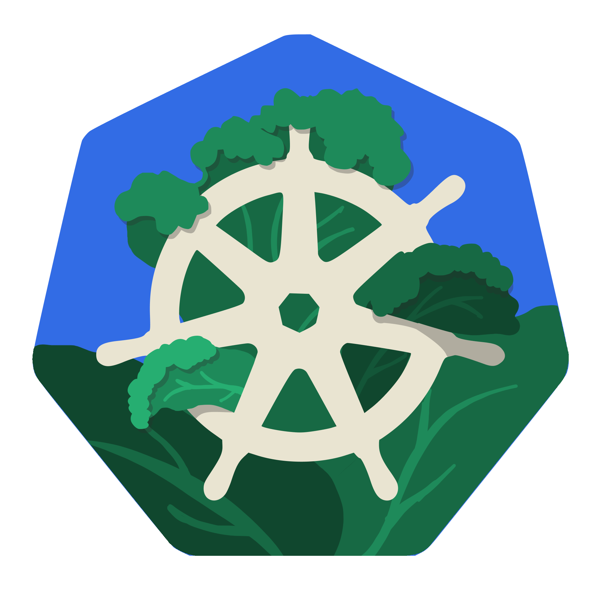
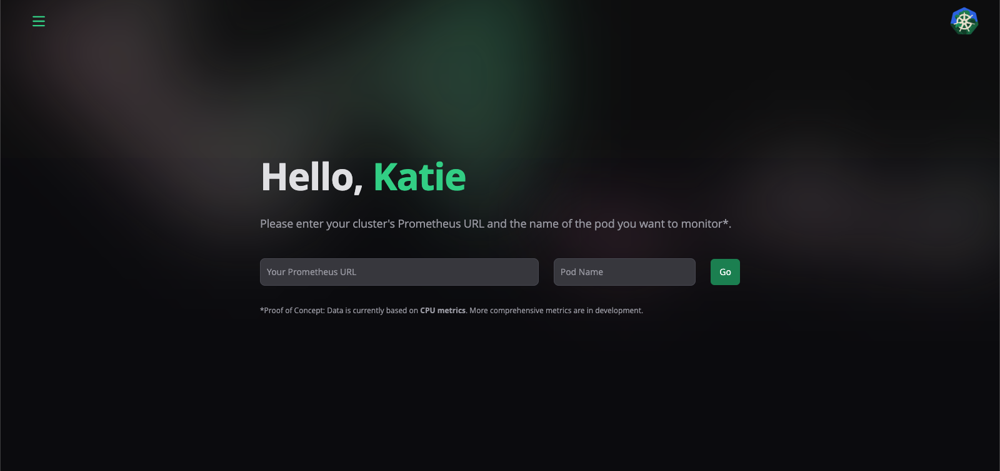
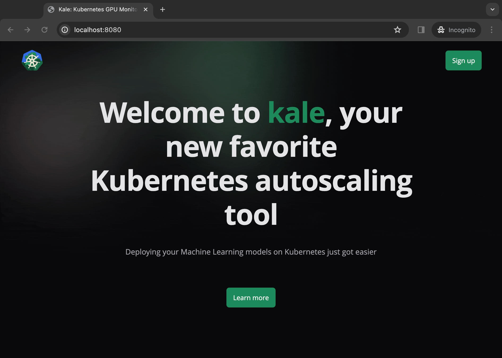
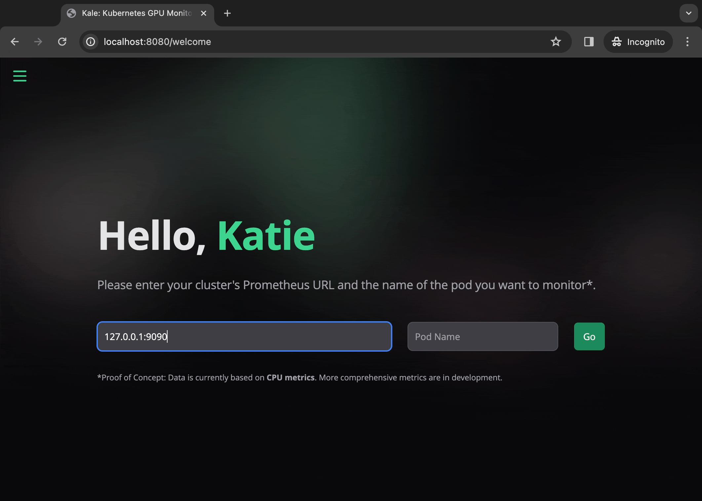
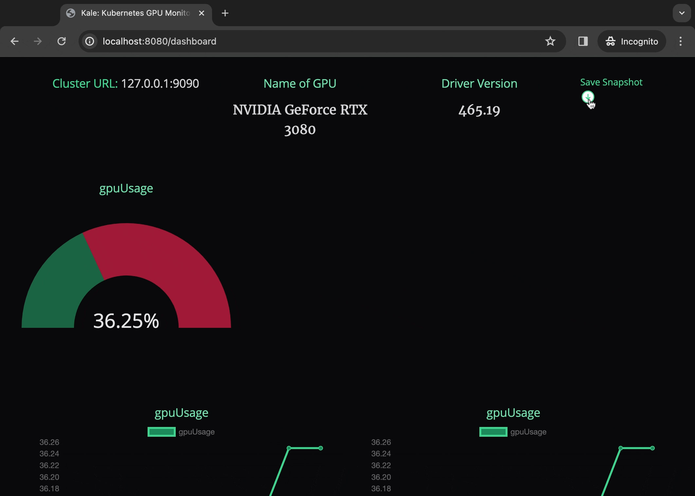
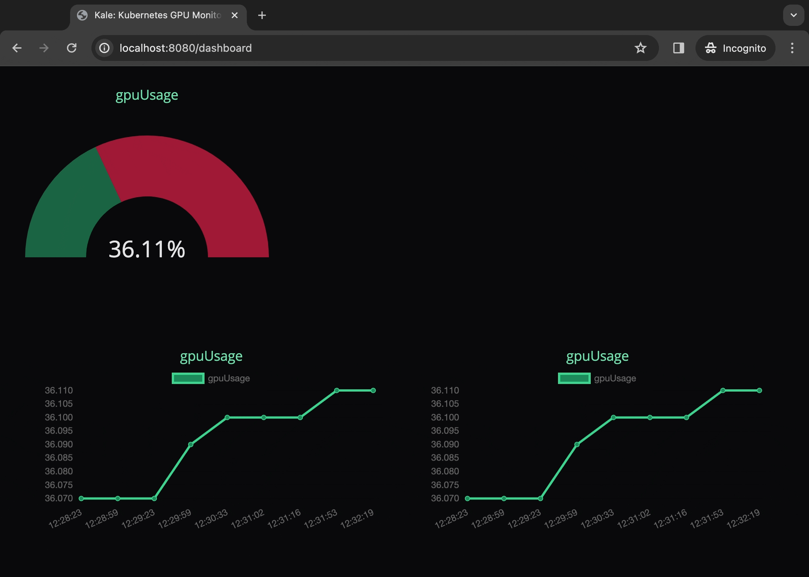

<div align="center">
  <h1 align="center">
    
    <p>kale</p>
  </h1>
  
  <p>kale is an open-source Kubernetes tool for monitoring and autoscaling machine learning workloads, specializing in GPU metrics for optimized scaling decisions.</p>
</div>


<p></p>
<p align="center">
  
  
  
</p>

## Features

- 📊 **Real-time GPU Monitoring**: Get live updates on utilization, temperature, power draw, and other essential GPU metrics with kale.
- 🗃️ **Metric Snapshots**: kale captures historical data points beyond real-time monitoring. These snapshots allow for in-depth analysis and performance optimization over time.
- 🧠 **Smart Scaling**: Optimize resource allocation for machine learning workloads with GPU-driven HPA configuration.

## Getting Started

The simplest and most efficient way to dive into kale is through [our official hosted service](https://).

### Prerequisites

Here's what you need to be able to run kale:

- GPU-enabled Kubernetes cluster
- Prometheus server integrated with cluster
- NVIDIA DCGM-exporter deployed in cluster

## Demo

1. 📝 Sign up for kale.

   

2. 📈 Enter Prometheus Server URL and Pod Name you would like to monitor.

   

3. 📸 Take a snapshot of your pod metrics and view your saved snapshots in your 'History' tab. Click on a saved snapshot to open up its metrics.

   

4. 🔄 Dashoboard updates metrics every 30 seconds.

   

## Run kale locally

⚠️ NOTE: You won't be able to save snapshots if you run kale locally.

### 1. Clone the repository

```shell
git clone https://github.com/oslabs-beta/kale.git
cd kale
```

### 2. Install npm dependencies

```shell
npm install
```

### 3. Run the dev server

```shell
npm run dev
```

### 4. Open the app in your browser

Visit [http://localhost:8080](http://localhost:8080) in your browser.

## Beta Limitations and Exciting Future

CPU-Based Proof of Concept: Currently, kale uses CPU metrics as a proxy for GPU utilization. This provides a valuable proof of concept.

**Roadmap: We envision exciting features including:**

- **GPU Metric Integration**: Replace CPU monitoring with direct GPU metric monitoring for enhanced scaling accuracy tailored to ML workloads.
- **Multi-Pod Monitoring**: Monitor resource consumption trends across multiple pods.
- **Snapshot Customization**: Allow users to rename snapshots for better organization.
- **Autoscaling Integration**: Directly trigger Kubernetes cluster scaling actions based on in-app analysis.

## Contributing

kale is open-source and welcomes your contributions! Here's how to get involved:

1. Fork the repository.
2. Make your desired changes.
3. Submit a pull request for review.

## Our Contributors

Sonia Han | [LinkedIn](https://www.linkedin.com/in/soheunhan/) | [Github](https://github.com/soheunhan)

Jeffrey Chao | [LinkedIn](https://www.linkedin.com/in/jeffrey-chao-9479142a/) | [Github](https://github.com/jeffplv)

Jinseong Nam | [LinkedIn](https://www.linkedin.com/in/jinseong-nam-8b6815212/) | [Github](https://github.com/thejinnam)

Ismael Boussatta | [LinkedIn](https://www.linkedin.com/in/ismael-boussatta-2493b2126/) | [Github](https://github.com/iboussat)
